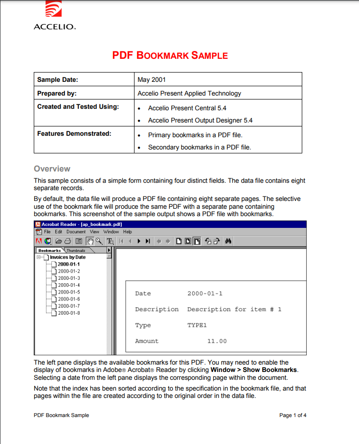
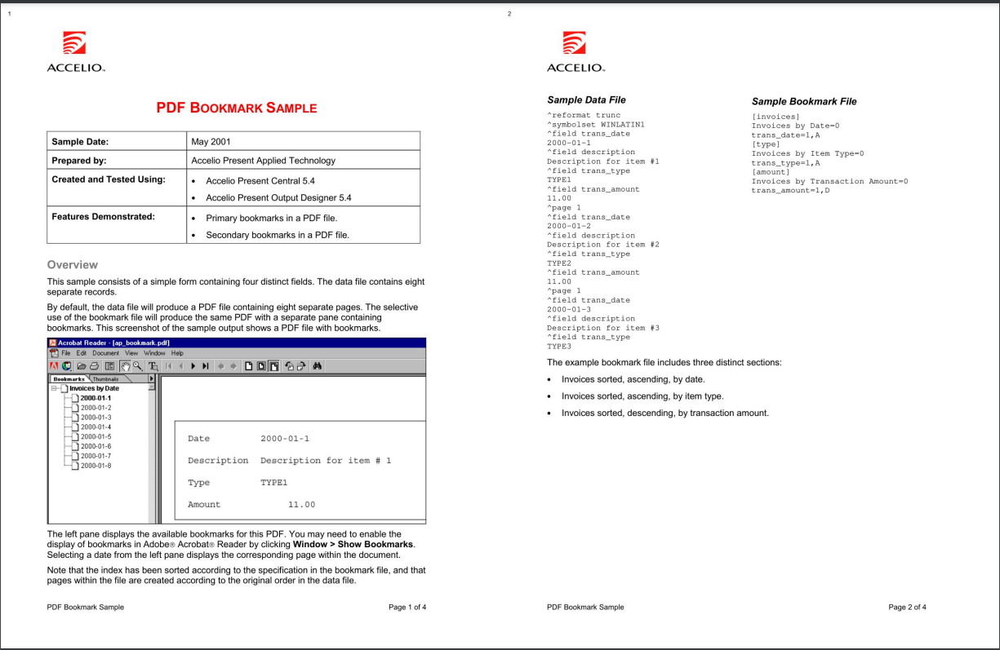

# PDFMerger

Merge individual pages of PDF file into one page

## Demo

### Merging 2 pages into 1

| Image 1 | Image 2 |
|---------|---------|
|  |  |


## Installation

```bash
pip install pdfmerge
```

**NOTE**: You need visual studio build tools for C++ to install `pdfmerge` package. Refer to [this](https://pymupdf.readthedocs.io/en/latest/installation.html#installation-when-a-suitable-wheel-is-not-available) for more information.

## Usage

### Command Line

You can use `pdfmerge` command to merge pdf files. It has following options:

```bash
pdfmerge <path> [-o <output>] [-g <group_size>] [-q <quality>]
```

Example:

```bash
pdfmerge ./test.pdf
```

This will merge `test.pdf` file and save it as `output.pdf` in the same directory.

**NOTE**: Output defaults to `output.pdf`, group size defaults to `2` and quality defaults to `1.5`.

### Python

You can also use `pdfmerge` package in your python code. It has following options:

```python
from pdfmerge import PDFMerge

pdf = PDFMerge(pdf_file=<path>, output_file=<output>, group_size=<group_size>, quality=<quality>, page_number=<page_number>)
pdf.run()
```

Example:

```python
from pdfmerge import PDFMerge

pdf = PDFMerge(pdf_file="./test.pdf", output_file="./output.pdf", group_size=2, quality=1.5)
pdf.run()
```
